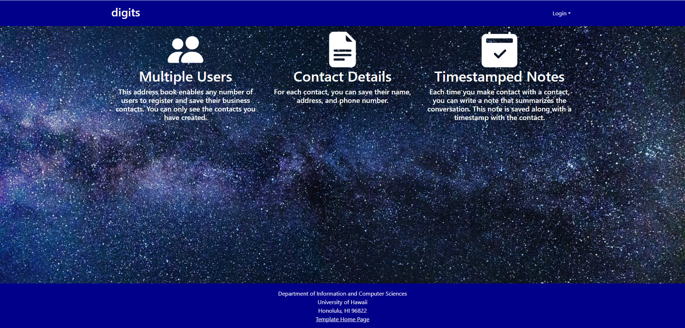
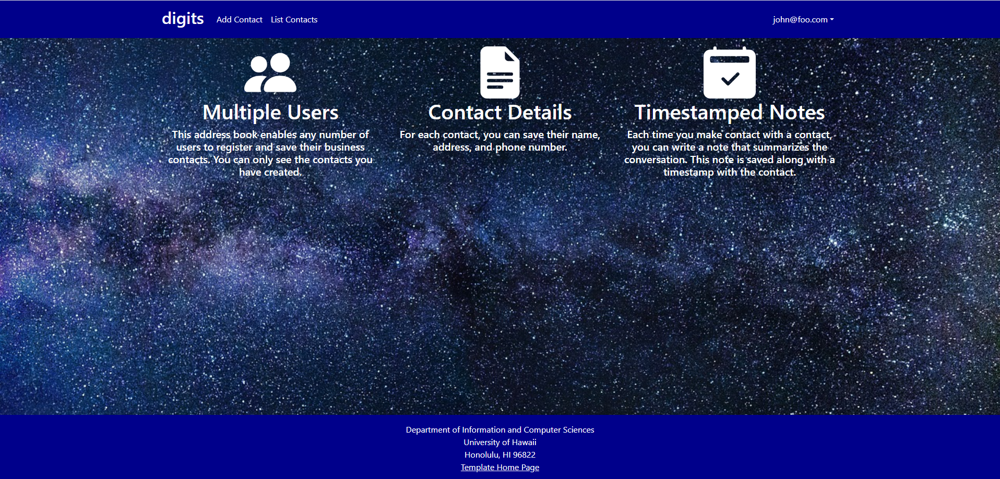
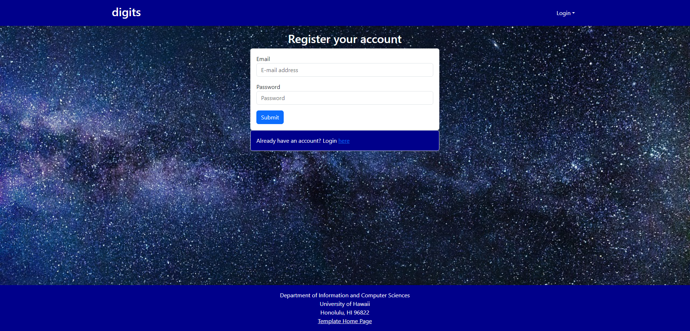
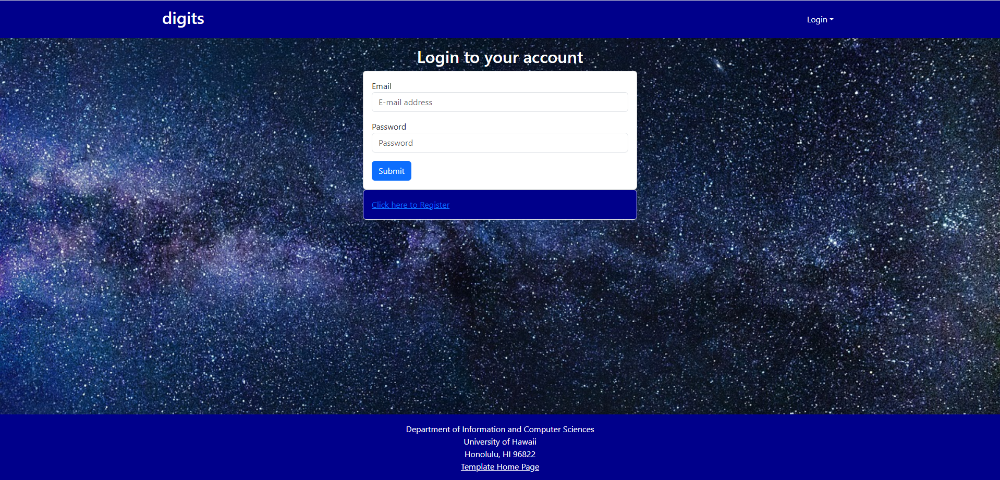
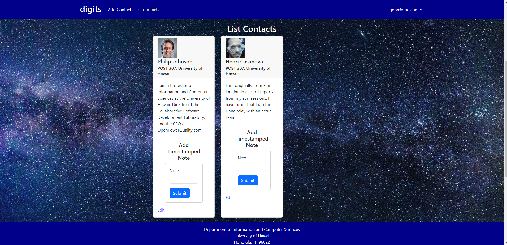
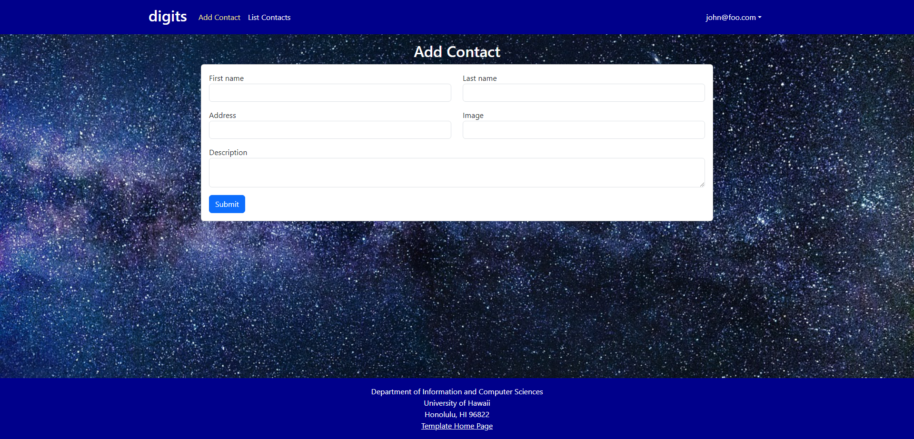
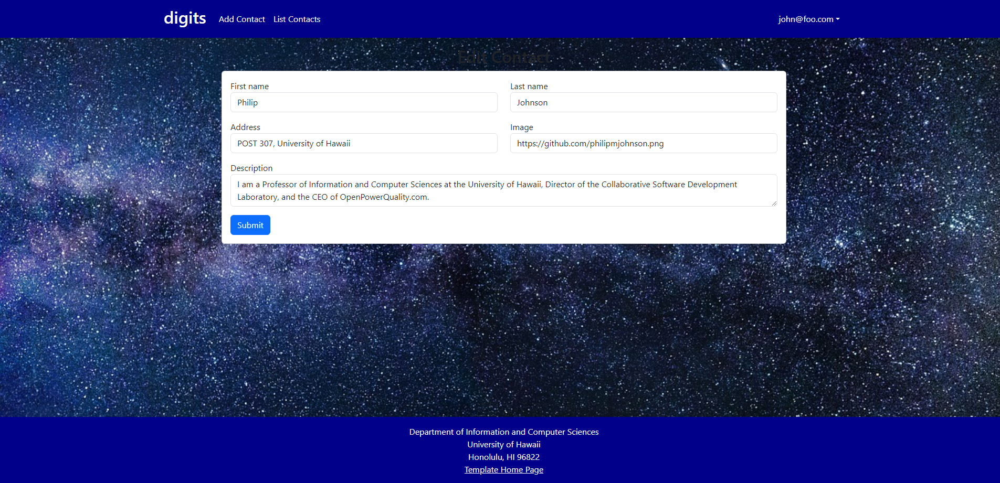
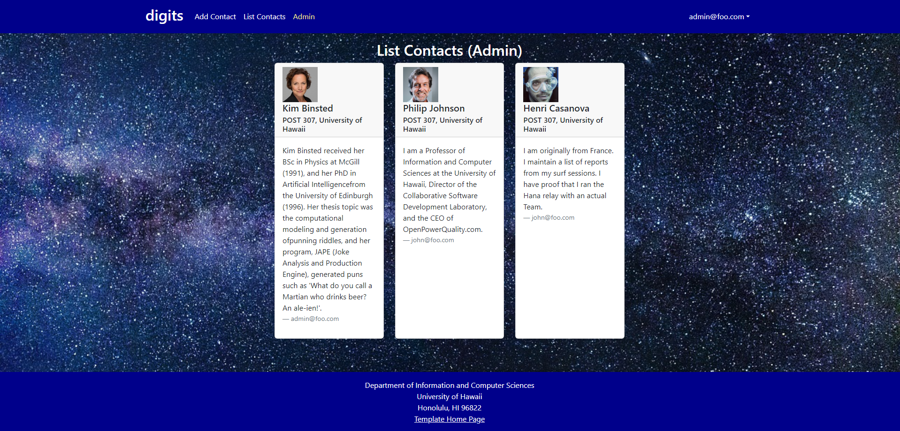

# digits-meteor-project


## Table of Contents
* [What is Digits?](#what-can-you-do-with-digits?)
* [Installation](#installation)
* [UI Walkthrough](#ui-walkthrough)
  
## What can you do with Digits?

* Register an account.
* Create and manage a set of contacts.
* Add timestamped notes for each contact.
* Edit contacts if information needs updating.
  
## Installation
First, install Meteor.

Second, download a copy of Digits.
Third, cd into the app directory and install the required libraries with:
```
$ meteor npm install
```

You can then run:
```
$ meteor npm run start
```
to start the app which will create some default contact user and contact data.


Lastly, you can run ESLint over the code in the imports/ directory with:
```
$ meteor npm run lint
```
This will help you to check for any ES Lint errors within your code.
## UI Walkthrough

### Landing Page
When you first bring up the application, you will see the landing page. The landing page gives a breif overview and allows you to sign in or sign up. 



### Register
If you do not yet have an account on the system, you can register by clicking on Login, then Sign Up.



### Sign in 
Click on the Login link, then click on the Signin link to bring up the Sign In page which allows you to login.



### User Home Page
After successfully logging in, the system takes you to your home page. It is just like the landing page, but the NavBar contains links to list contact and add new contacts.


### List Contacts
Clicking on the List Contacts link brings up a page that lists all of the contacts associated with the logged in user.



### Add Contacts
From the List Contacts page, the user can add information about a contact into the form and press submit to add the contact to their contact list. 



### Edit Contacts
From the List Contacts page, the user can click the Edit link associated with any Contact to bring up a page that allows that Contact information to be edited.




### Admin Mode
It is possible to designate one or more users as Admins through the settings file. When a user has the Admin role, they get access to a special NavBar link that retrieves a page listing all Contacts associated with all users.




